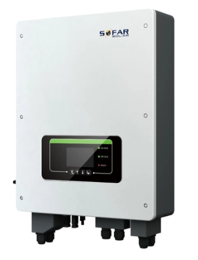
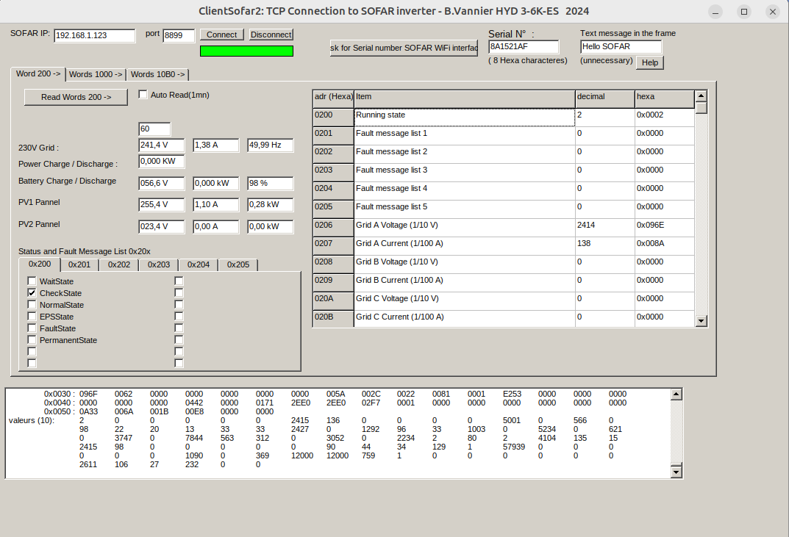
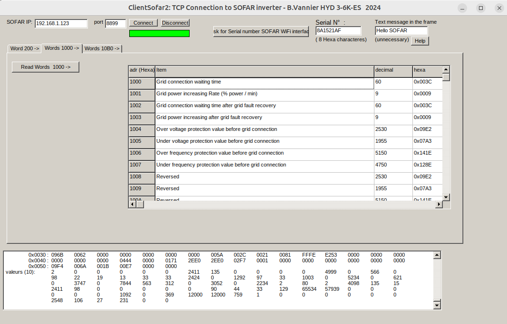
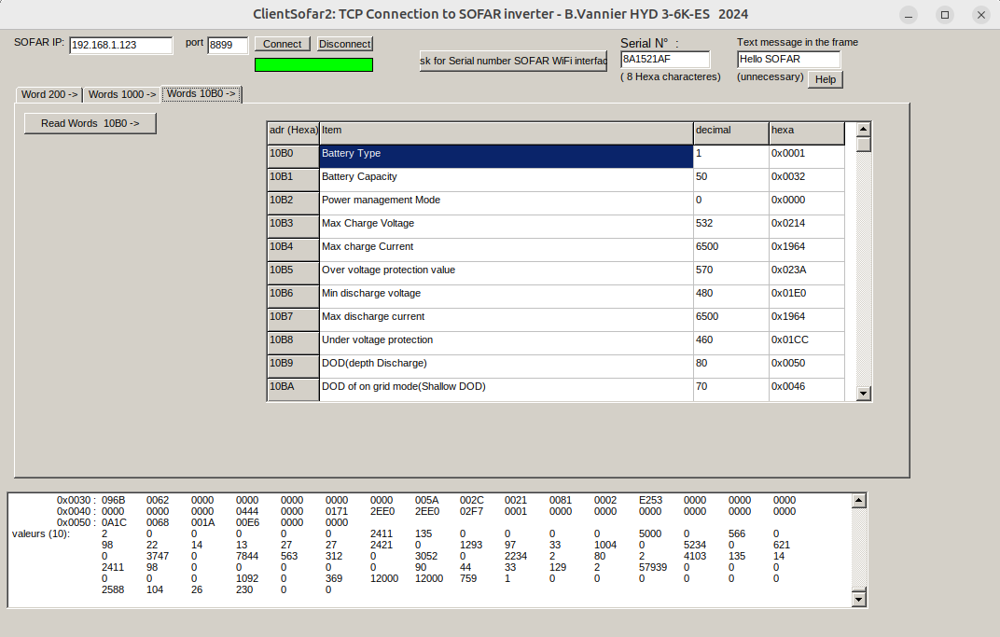

# Sofar_Modbus_Wifi

Windows app to read Sofar Inverter HYD3000/6000-ES information   
This sotfware has been develloped under C++ Builder 6 ( Borland )   

# screenshot
    
    
    

# Operation
This software ( ClientSofar2 ) requests information from the Sofar hybrid inverter via Wifi.  
The request consists of a Modbus frame, included in a special Sofar TCP frame.  
It returns various information as product power, load power, errors, etc ...  

# Using ClientSofar2
Specify your IP Inverter and clic "Connect"   
Clic on "Ask for Serial number Wifi Interface"   
Clic on "Read Word XXX ->"

# Other Sofar Inverters
This software has been tested on HYD6000-ES.  
It probably can function on all HYDXXX-ES and ME3000SP series.  
But it can't function on HYDXXX-EP series, because the addresses words are not the same.  
